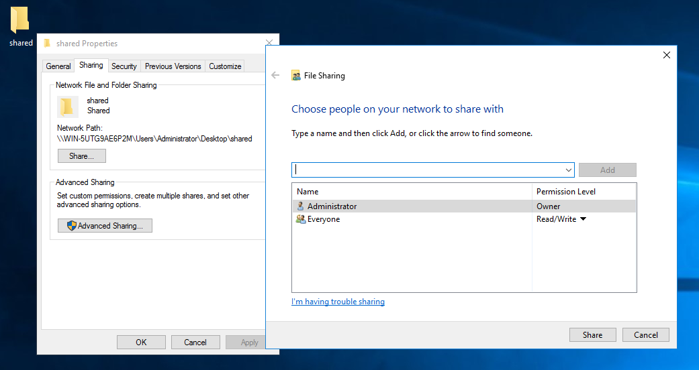
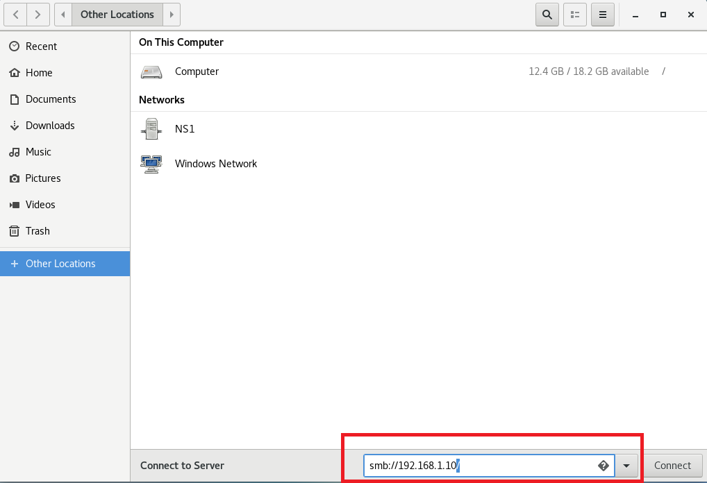
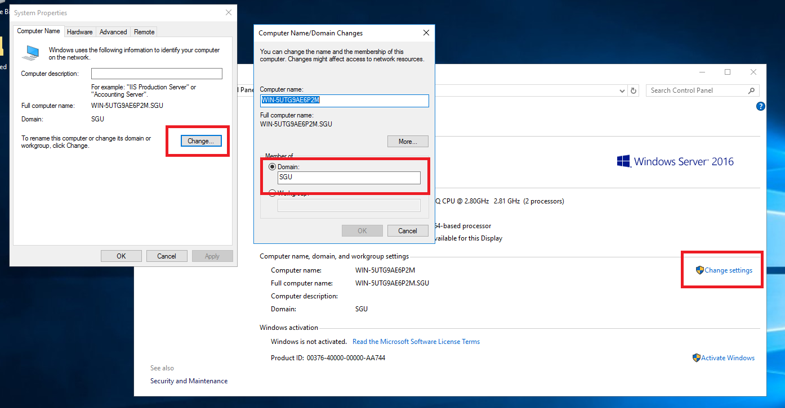

# Cấu hình Samba chia sẻ file trên CentOS 

## I. Hướng dẫn chuẩn bị
### 1. Cài đặt gói samba
- Tiến hành cài đặt gói samba để cấu hình: ```yum install samba* -y```

## II. Cấu hình chia sẻ file cho Anonymous
### 1. Tạo thư mục Anonymous để tiến hành chia sẻ thư mục:
```C++
 mkdir -p /samba/anonymous
```
### 2. Cấu hình file smb.conf
```C++
 gedit /etc/samba/smb.conf
```
- Thêm đoạn sau vào file config:
```C++
[Global]
	workgroup = workgroup
	server string = Samba Server %v
	netbios name = centos
	map to guest = bad user
	dns proxy = no
	ntlm auth = yes

[Anonymous]
	path = /samba/anonymous
	browsable = yes
	writable = yes
	guest ok = yes
	read only = no

[homes]
	comment = Home Directories
	valid users = %S, %D%w%S
	browseable = No
	read only = No
	inherit acls = Yes

[printers]
	comment = All Printers
	path = /var/tmp
	printable = Yes
	create mask = 0600
	browseable = No

[print$]
	comment = Printer Drivers
	path = /var/lib/samba/drivers
	write list = @printadmin root
	force group = @printadmin
	create mask = 0664
	directory mask = 0775
```
### 3. Lưu file config và khởi động dịch vụ bằng câu lệnh:
```C++
systemctl start smb.service
```
  ```C++
systemctl start nmb.service
```
- Để không gặp rắc rối khi client kết nối đến server, ta cần tắt firewall bằng lệnh sau:
```C++
systemctl stop firewalld
```
```C++
systemctl disable firewalld
```
- Tắt SELINUX.
- Chỉnh sửa file config SELinux bằng lệnh:
```C++
gedit /etc/selinux/config
```
- Bên trong file, thay đổi giá trị SELINUX từ enforcing sang disabled:
```C++
SELINUX=disabled
```
- Cấp quyền truy cập file anonymous:
```C++
chmod -R 0755 /samba/anonymous/
```
```C++
chown -R nobody:nobody /samba/anonymous/
```
### 4. Vào run và nhập vào địa chỉ IP của máy CentOS.
```\\192.168.1.1```

## III. Cấu hình chia sẻ file với quyền security
### 1. Tạo user và group để chuẩn bị cho việc chia sẻ.
```C++ 
useradd u1
```
```C++ 
passwd u1
```
```C++ 
groupadd samba
```
```C++ 
usermod -a -G samba u1
```
### 2. Tạo thư mục chia sẽ file
```C++
mkdir /samba/Share
```
```C++
chgrp samba /samba/Share
```
```C++
chmod -R 777 /samba/Share
```
- Thêm người dùng u1 vào dịch vụ samba và đặt password bằng câu lệnh:
```C++
smbpasswd -a u1
```
### 3. Cấu hình 
- Cấu hình tệp tin ```/etc/samba/smb.conf``` và thêm vào đoạn sau:
```C++
[global]
	workgroup = WORKGROUP
	server string = Samba_Server
	netbios name = centos
	security = user
	map to guest = bad user
	dns proxy = no
	ntlm auth = yes
[Anonymous]
	path = /samba/anonymous
	browsable = yes
	writable = yes
	guest ok = yes
	read only = no
[Share]
	path = /samba/Share
	browsable = yes
	writable = yes
	read only = no
	valid user = @samba
	guest ok = no
```
- Trên máy Windows, vào run nhập vào địa chỉ IP máy và đăng nhập bằng user vừa tạo:
  ``` \\192.168.1.1 ```

## IV. Thực hiện lấy file chia sẻ từ Windows ở máy CentOS.
- Trên máy Windows, tạo 1 thư mục được chia sẻ như sau:


- Trên máy CentOS, mở home, vào phần connect to server nhập vào smb://địa chỉ IP của
máy muốn truy cập/
``` smb://192.168.1.10 ```

## V. CÀI ĐẶT CẤU HÌNH DOMAIN TRÊN CENTOS SERVER
### 1. Chuẩn bị:
- Máy Domain Controller:
  - OS: CentOS 7
  - Hostname: server.sgu.edu.vn
  - IP Address: 192.168.1.1/24
  - Samba Domain: sgu.vn

- Và 1 máy client:
  - OS: Windows 
  - Hostname: PC
  - IP Address: 192.168.1.10/24

### 2. Cấu hình
- Tệp ```/etc/samba/smb.conf```
```C++
[Global]
	workgroup = sgu.vn
	realm = sgu.vn
	security = user
	domain master = yes
	domain logons = yes
	local master = yes
	preferred master = yes
	passdb backend = tdbsam
	idmap config * : range = 3000 - 7999
	idmap config * : backend = tdb
	logon path = \\%L\Profiles\%U 
	logon script = logon.bat
	add machine script = /usr/sbin/useradd -d /dev/null -g 200 -s /sbin/nologin -M %u
	lanman auth=yes
	ntlm auth=yes


[homes]
	comment = Home Directories
	browseable = yes
	writable = yes

[netlogon] 
	comment = Network Logon Service
	path = /var/lib/samba/netlogon
	browseable = No
	writable = No

[Profiles] 
	path = /var/lib/samba/profiles
	create mask = 0755
	directory mask = 0755
	writable = Yes
```
- Kiểm tra lại file bằng câu lệnh:
``` testparm ```

- Tạo thư mục để chứa profile và các file cho user khi thực hiện netlogon.
```C++
 mkdir -m 1777 /var/lib/samba/netlogon
```
```C++
 mkdir -m 1777 /var/lib/samba/profiles
```
- Thực hiện tạo ra các tài khoản computer của client để có thể join vào hệ thống miền. Ta tạo
ra group:
```C++
groupadd -g 200 machine
```
```C++
smbpasswd -m -a machine1$
```

- Tạo ra user cho người dùng đăng nhập:
```C++
 useradd user1
```
```C++
 useradd user2
```
```C++
smbpasswd -a root
```
```C++
smbpasswd -a user1
```
```C++
smbpasswd -a user2
```

- Start các dịch vụ của Samba
```C++
systemctl start smb
 ```
```C++
systemctl start nmb
```

- Để thực hiện join miền, ta vào máy client. Tại đây, ta phải bảo đảm máy client đã có IP và
giao tiếp được với máy server. Sau khi đảm bảo được điều này, ta có thể click phải vào ``` my
computer``` chọn ```Properties``` chọn ```Change settings```, chọn ```Change```.

- Tại mục domain, gõ tên là sgu để tìm. Sau đó nhập user là root và password đã đặt trước
đó.
- Trong trường hợp join mà báo lỗi không thấy domain. Fix lỗi bằng cách vào registry chỉnh sửa như sau:
- Mở cmd: nhập ```regedit```

- Đi theo đường dẫn sau: HKEY_LOCAL_MACHINE -> SYSTEM -> CurrentControlSet -> Services -> LanmanWorkstation -> Parameters.

- Tạo ra 2 file dạng DWORD có tên là:
```DomainCompatibilityMode``` có value là 1
```DNSNameResolutionRequired``` có value là 0

- Sau đó thực hiện join miền bình thường

